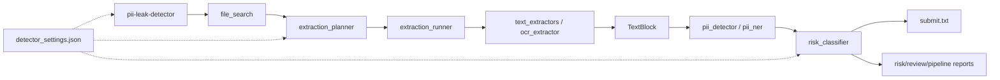

# PII Leak Detector

CLI-инструмент для поиска высокорисковых утечек персональных данных в смешанных файловых хранилищах. Он рекурсивно сканирует папку, извлекает текст и таблицы, находит категории ПДн, оценивает контекст хранения и формирует короткий `submit.txt` с путями подозрительных файлов.

## Быстрый старт

```bash
python -m venv .venv
source .venv/bin/activate
pip install -e . -c constraints.txt
pii-leak-detector doctor
pii-leak-detector scan share --mode fast
```

Алиас:

```bash
pld scan share --mode normal
```

Старый запуск (сохранен для совместимости):

```bash
python main.py share --mode fast
```

## Команды CLI

```bash
pii-leak-detector scan [folder] [options]
pii-leak-detector doctor
pii-leak-detector init-config [path]
```

`scan` запускает pipeline. Без режима и флагов используется `fast`:

```bash
pii-leak-detector scan share
```

`doctor` проверяет Python-зависимости, наличие `detector_settings.json` и системный `tesseract`.

`init-config` копирует активный шаблон настроек:

```bash
pii-leak-detector init-config configs/detector_settings.json
PII_DETECTOR_SETTINGS=configs/detector_settings.json pii-leak-detector scan share --mode normal
```

Подробно: [CLI guide](guides/cli.md).

Зависимости и lock-файлы: [dependencies guide](guides/dependencies.md).

## Режимы

| Режим | Для чего | OCR | ML/NER | Типичный результат |
|---|---|---:|---:|---|
| `fast` | быстрый строгий submit | нет массового OCR | выключен | минимальный FP, ниже recall |
| `normal` | основной режим без тяжелого OCR | выключен по умолчанию | выключен | шире fast, но контролируемый |
| `hard` | глубокая проверка с OCR-бюджетом | ограниченный | opt-in | дороже и шумнее, требует тюнинга |

Примеры:

```bash
pii-leak-detector scan share --mode fast
pii-leak-detector scan share --mode normal --max-candidates 250
pii-leak-detector scan share --mode hard --max-ocr-files 40
pii-leak-detector scan share --mode normal --ml --ml-max-files 20
```

## Выходные файлы

Для каждого режима дефолтные пути задаются в `detector_settings.json`.

```text
out/submit_fast.txt
out/risk_report_fast.md
out/pipeline_report_fast.md
out/review_report_fast.md
```

`submit_*.txt` содержит только пути от корня `share`, по одному на строку.  
`risk_report_*.md` показывает score, категории ПДн и правила.  
`review_report_*.md` показывает submit, кандидатов ниже порога и подавленные срабатывания.  
`pipeline_report_*.md` показывает scan, triage, extraction, PII evidence, risk и OCR/ML статус.

## Настройки

Главный файл тюнинга: [detector_settings.json](detector_settings.json).

В нем находятся:

- `mode_defaults` - дефолтные output-файлы, `max_candidates`, `triage_min_score`, включение escalation;
- `runtime_defaults` - лимиты OCR/ML и review floor;
- `triage` - дешевые веса отбора кандидатов до извлечения;
- `planner` - лимиты и эвристики планировщика extraction/OCR;
- `risk` - submit threshold, веса категорий, веса правил, suppress/boost-контексты.

Подробно: [settings guide](guides/settings.md) и [developer guide](guides/developer.md).

## Архитектура



Детально: [pipeline guide](guides/pipeline.md).

## Репозиторий

```text
pii_leak_detector/       устанавливаемая CLI-оболочка
setup.py                 метаданные установки и скрипты консоли
requirements.txt         прямые runtime-зависимости с фиксированными версиями
constraints.txt          lock проверенных транзитивных зависимостей
main.py                  оркестрация конвейера и устаревшая точка входа
settings.py              обнаружение и загрузка конфигурации
detector_settings.json   системные параметры
file_search.py           инвентаризация файлов и определение их типов
extraction_planner.py    маршрутизация извлечения и OCR
extraction_runner.py     выполнение планов извлечения данных
text_extractors.py       простые экстракторы и адаптеры OCR с ограничениями
ocr_extractor.py         вспомогательные инструменты OCR на базе Tesseract
pii_detector.py          обнаружение PII через регулярные выражения и контрольные суммы
pii_ner.py               необязательный слой NER на базе Presidio/spaCy
risk_classifier.py       оценка, выбор отправки и отчеты
guides/                  документация для пользователей, разработчиков и по архитектуре
```
