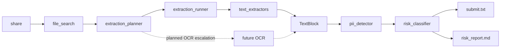

# **PII Leak Detector** is a tool designed to identify and prevent the exposure of personally identifiable information.


## Как запустить:

```bash
python main.py <путь_к_папке>
```

Быстро сформировать submit без массового OCR/PDF-разбора:

```bash
python main.py <путь_к_папке> --fast
```

Построить сводку планов извлечения после инвентаризации:

```bash
python main.py <путь_к_папке> --plan
```

Выполнить базовое извлечение текста без OCR:

```bash
python main.py <путь_к_папке> --extract
```

Найти категории ПДн после базового извлечения:

```bash
python main.py <путь_к_папке> --detect-pii
```

Оценить риск и сформировать submit для бота:

```bash
python main.py <путь_к_папке> --risk --submit out/submit.txt --risk-report out/risk_report.md
```

Запустить глубокий прогон с целевыми OCR-эскалациями:

```bash
python main.py <путь_к_папке> --risk --ocr --submit out/submit_ocr.txt --risk-report out/risk_report_ocr.md
```

Smoke-прогон на первых N файлах:

```bash
python main.py <путь_к_папке> --detect-pii --extract-limit 50
```

## Схема pipeline



> Полное описание цикла: [pipeline](guides/pipeline.md)

## Назначение файлов

### file_search.py

Сканер принимает абсолютный путь и на отвечает за инвентаризацию файлов:
* определяет исходное расширение
* предполагаемый формат
* MIME-тип
* семейство формата
* уровень уверенности и статус определения.

> Детальное описание: [file_search](guides/file_search.md)

### extraction_planner.py

Планировщик принимает результаты сканера и выбирает маршрут извлечения:
* прямое чтение текста;
* структурный парсинг таблиц и JSON/Parquet;
* извлечение цифрового текста из документов;
* условную OCR-эскалацию для PDF-страниц, изображений, embedded images и видео;
* пропуск нерелевантных файлов вроде executable.

> Детальное описание: [extraction_planner](guides/extraction_planner.md)

### text_blocks.py

Единый формат текстового блока для следующих этапов пайплайна:
* путь к файлу;
* источник текста;
* номер блока;
* страница, лист или диапазон строк;
* метод извлечения;
* текст, предупреждения и технические метаданные.

### text_extractors.py

Набор дешевых извлекателей текста без OCR:
* TXT/Markdown;
* HTML;
* CSV/TSV;
* JSON;
* PDF с цифровым текстовым слоем;
* DOCX;
* RTF;
* XLSX.

### extraction_runner.py

Исполняет primary-шаги из `ExtractionPlan` и собирает `TextBlock`-и.

> Детальное описание: [text_extractors](guides/text_extractors.md)

### pii_detector.py

Ищет категории ПДн в `TextBlock`-ах:
* ФИО, email, телефоны, адреса и даты рождения;
* паспорт РФ, СНИЛС, ИНН, MRZ;
* банковские карты, счета, БИК и CVV;
* специальные категории через keyword-детекторы.

> Детальное описание: [pii_detector](guides/pii_detector.md)

### risk_classifier.py

Оценивает подозрительность файлов и формирует `.txt` submit:
* учитывает категории ПДн, массовость, сочетания идентификаторов;
* добавляет контекст пути и формата;
* снижает score для вероятно публичных или деловых документов;
* пишет пути от корня `share`, как ожидает бот.

> Детальное описание: [risk_classifier](guides/risk_classifier.md)
