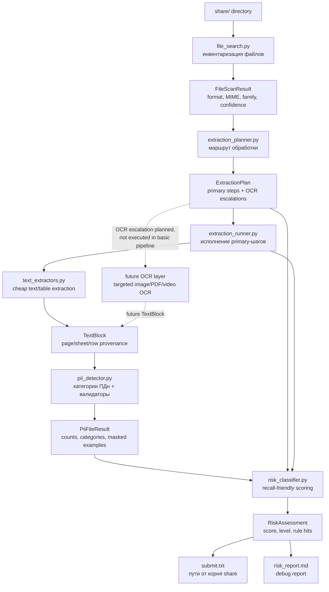
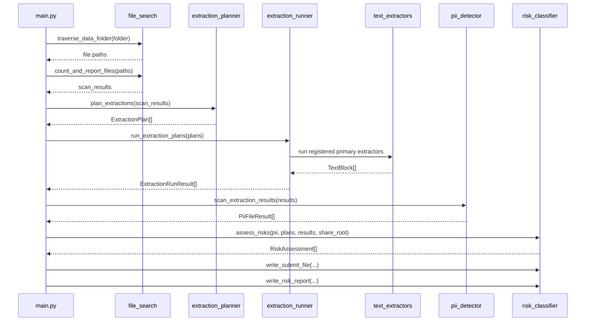

# Полный цикл PII Leak Detector

## End-to-end схема



## Что делает каждый слой

| Слой | Вход | Выход | Ответственность |
|---|---|---|---|
| `file_search.py` | Путь к папке | `FileScanResult` | Быстро определить формат, MIME, family, размер и уверенность. |
| `extraction_planner.py` | `FileScanResult` | `ExtractionPlan` | Решить, какой extractor нужен и где может понадобиться OCR. |
| `extraction_runner.py` | `ExtractionPlan` | `ExtractionRunResult` | Запустить primary-шаги и собрать блоки текста. |
| `text_extractors.py` | Файл + параметры шага | `TextBlock` | Дешево извлечь цифровой текст, таблицы и HTML без OCR. |
| `pii_detector.py` | `TextBlock` | `PiiFileResult` | Найти категории ПДн, валидировать контрольные суммы, маскировать примеры. |
| `risk_classifier.py` | Plan + extraction + PII | `RiskAssessment` | Оценить подозрительность, выбрать submit-кандидатов, объяснить правила. |

## Текущий runtime-путь



## Команды

Полный baseline submit:

```bash
python main.py share --risk --submit out/submit.txt --risk-report out/risk_report.md
```

Все сводки сразу:

```bash
python main.py share --plan --extract --detect-pii --risk --submit out/submit.txt --risk-report out/risk_report.md
```

Smoke-прогон:

```bash
python main.py share --risk --extract-limit 180
```

## Важные границы

- OCR сейчас только планируется в `ExtractionPlan`, но не выполняется в базовом pipeline.
- `pii_detector.py` не решает, является ли файл утечкой; он только дает признаки.
- `risk_classifier.py` формирует текущий baseline submit для бота.
- Submit содержит только пути от корня `share`, по одному пути на строку.
