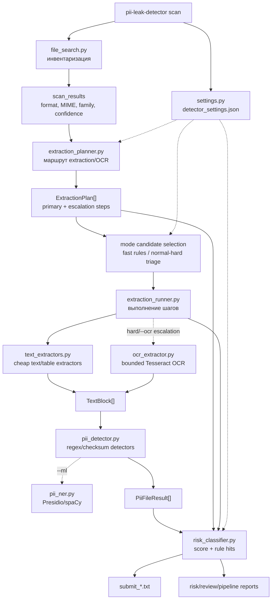

# Pipeline guide

PII Leak Detector работает как staged pipeline: каждый слой делает одну работу и передает дальше структурированные объекты. 

CLI и настройки находятся снаружи pipeline и управляют режимами, лимитами и output-файлами.

## End-to-end схема



## Слои и контракты

| Слой | Вход | Выход | Ответственность |
|---|---|---|---|
| `pii_leak_detector/cli.py` | argv | exit code | Продуктовые команды `scan`, `doctor`, `init-config`. |
| `main.py` | parsed args | reports/files | Orchestration pipeline и legacy entry point. |
| `settings.py` | JSON config | Python values | Поиск и загрузка активных настроек. |
| `file_search.py` | folder | scan results | Быстро определить тип, family, MIME, размер, уверенность. |
| `extraction_planner.py` | scan results | `ExtractionPlan` | Решить, чем читать файл и где разрешить OCR. |
| `extraction_runner.py` | plans | run results | Запустить extractors и собрать `TextBlock`. |
| `text_extractors.py` | file + params | `TextBlock` | Дешевый цифровой текст, таблицы, HTML, DOCX, PDF text. |
| `ocr_extractor.py` | OCR target | text | Дорогой Tesseract OCR для hard/escalation. |
| `pii_detector.py` | `TextBlock` | `PiiFileResult` | Категории ПДн, контрольные суммы, маскированные примеры. |
| `pii_ner.py` | `TextBlock` | findings | Опциональный Presidio/spaCy слой по `--ml`. |
| `risk_classifier.py` | PII + plan + extraction | `RiskAssessment` | Score, levels, submit selection, explanations. |

## Режимы runtime

### Fast

`fast` выбирает только дешевые и узко подозрительные кандидаты:

- текст, таблицы, структурированные файлы;
- ELF/binary embedded payload probe;
- видео как manual-review candidate;
- офисные документы только с явным контекстом;
- без массового PDF/HTML/image OCR.

### Normal

`normal` сначала считает cheap triage по всем файлам, затем извлекает ограниченный pool:

- больше документов и web, чем fast;
- без OCR escalation по умолчанию;
- ML/NER выключен, но доступен через `--ml`.

### Hard

`hard` использует тот же triage, но шире candidate pool и включает bounded OCR budget:

- `--max-candidates` ограничивает общий pool;
- `--max-ocr-files` ограничивает OCR targets;
- `--max-ocr-files 0` полезен для проверки отбора без дорогого OCR.

## Output lifecycle

1. `submit_*.txt` - короткий список путей для бота в телеграмм.
2. `risk_report_*.md` - score/rules/categories по оцененным файлам.
3. `review_report_*.md` - submit, review candidates и top suppressed.
4. `pipeline_report_*.md` - scan, candidate selection, extraction, PII, OCR/ML статус.

Submit path всегда считается от корня сканируемой папки:

```text
/Выгрузки/дочерние предприятия/Billing/physical.parquet
```

## Где менять поведение

- Дефолтные режимы и outputs: `detector_settings.json -> mode_defaults`.
- Candidate selection: `detector_settings.json -> triage`.
- OCR/extraction лимиты: `detector_settings.json -> planner`.
- Submit threshold и scoring: `detector_settings.json -> risk`.
- Новые extractor-ы: `text_extractors.py` + `extraction_runner.py` + `extraction_planner.py`.
- Новые категории ПДн: `pii_detector.py`, при необходимости `pii_ner.py`.
